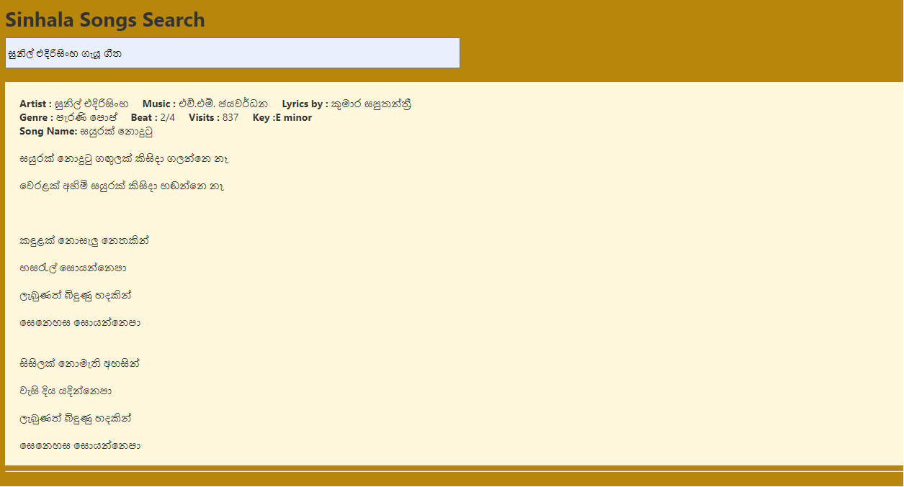
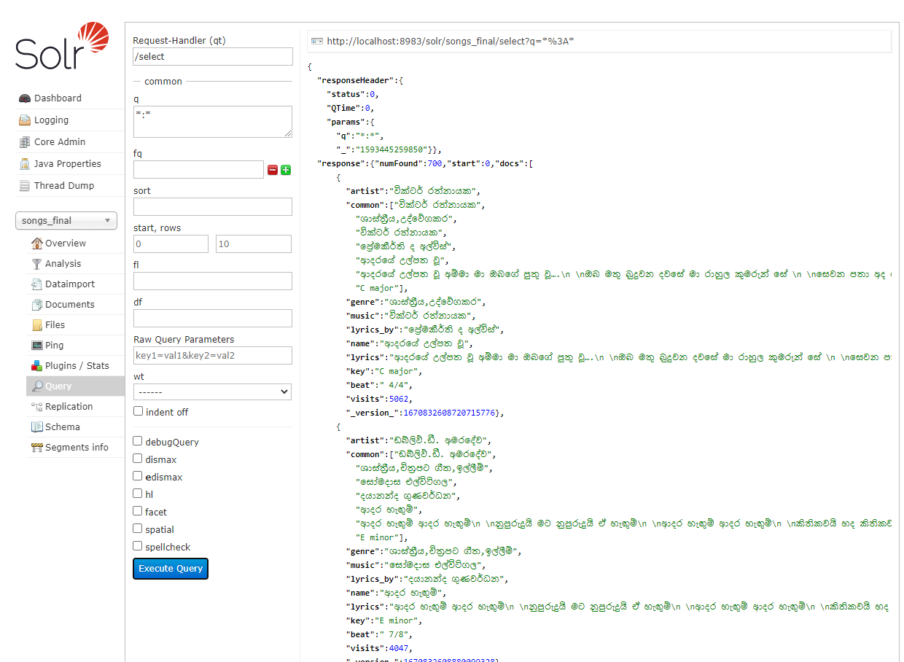

# Sinahala Lyrics Search Engine



## Quick Start
To start the search engine follow the instructions given below.

- Start an solr on the port 8983
- Copy the ```solr configuration``` folder to solr-xxx/server/solr/
- Rename folder to other name (This is the name of the core)
- Create the core using solr admin
- Add the docs in ```Data``` folder to solr core. Use solr admin or following commands to add docs.
    - Windows : ```java -Dc=core_name -jar post.jar song.xml```
    - Linux : ```./post -c songs songs.xml```
- Run the command ```ng serve```  inside search-ui directory
- Visit <a href="http://localhost:4200">http://localhost:4200</a>
- Enter the search query in the search box in the website


Refer [README.md](search-ui/README.md) for more details on setting up the frontend

## Main Functionalities
- Synonyms support
- Stop words support
- Stemming support
- Protected stemming support
- Spell check suggetions
- Wild card queries
- Range queries
- Faceted queries
- Other queries such as term query, phrase query 

#### Sample queries with UI
- Songs by artist, music and lyrics writer<br>
    *Ex:-*
     - පණ්ඩිත් අමරදේව ගැයූ ගීත
     - සුනිල් ආරියරත්න ලියූ ගීත
- Range queries<br>
    *Ex:-* 
    - නැරඹුම් වාර 5000 ට වැඩි ගීත
    - හොඳම​සිංදු 10
- Phrase queries<br>
    *Ex:-*
    - "සුනිල් ආරියරත්න" ලියූ ගීත
- Wild card queries<br>
    *Ex:-*
    - අමර* ගැයූ ගීත
- Synonyms<br>
    *Ex:-*
     - මව ගැන ගීත
- Stop words eliminated<br>
   *Ex:-*
   - ඇන්ජලීන් ගුණතිලක  හා එච්.ආර්. ජෝතිපාල ගේ ගීත
- Queries with stemming<br>
    *Ex:-*
    - බියෙන් සැකෙන්
- Others<br>
    *Ex:-* 
    - පැරණි පොප්
    - අහසයි ඔබ මට නිම් හිම් නොපෙනෙන ගීතයේ පද

#### Sample queries with Solr terminal



- Spell check suggetions <br>
    *Ex:-* 
     - searching අමරදව gives අමරදේව
 - Facet Search <br>
    *Ex:-*
    - Get count of genre type
 - The queries in above section can also be done on solr ui. 

## Structure of the Data

Each song contains the following data fields. The data is scraped from <a href="https://sinhalasongbook.com/">sinhalasongbook.com</a><br>

```name```: name of the song <br>
```artist```: list containing artists <br>
```genre```: list containing genres<br>
```lyrics_by```: list containing lyric writers <br>
```music```: list containing music directors <br>
```key:``` key of the song<br>
```beat:``` beat of the song<br>
```visits:``` no of views for the song in original site<br>
```lyrics:``` lyric (each line seperated by a \n character)<br>

Refer  [README.md](Preprocess/README.md) for more details on scraping and preprocessing data.

## Indexing and Querying Techniques Used

### Indexing Filters
- Tokenizer
- Prot Words Filter
- Stop Words Filter
- Hunspell Stem Filter Factory for stemming


### Query Filters
- Tokenizer
- Spell checker
- Prot Words Filter
- Stop Words Filter
- Synonym Filter
- Hunspell Stem Filter Factory for Stemming
- Remove Duplicate Filter 


